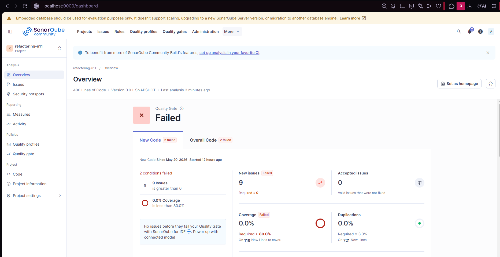

# Bautista-post2-u11
Actividad Post-Contenido 2 / Unidad 11

# Pedido Refactor — Post Contenido 2 Unidad 11

## Patrones de Diseño de Software
### Refactorización Avanzada y Clean Code Profundo

---

# Integrante

- Jahir Bautista

---

# Objetivo de la Actividad

Aplicar técnicas avanzadas de refactorización para reducir la complejidad ciclomática del proyecto utilizando:

- Replace Conditional with Polymorphism
- Guard Clauses
- Strategy Pattern
- Open/Closed Principle

Además, validar las mejoras utilizando SonarQube y mantener el Quality Gate en estado Passed.

---

# Tecnologías Utilizadas

- Java 17
- Spring Boot
- Maven
- JUnit 5
- SonarQube
- JaCoCo
- Git & GitHub

---

# Paso 1 — Código Inicial con Alta Complejidad

Se agregaron métodos con problemas de diseño:

## Switch Statement Smell

```java
public double calcularEnvio(Pedido pedido, String tipoEnvio) {

    switch (tipoEnvio) {

        case "ESTANDAR":
            return pedido.getTotal() > 50 ? 0 : 5.99;

        case "EXPRESS":
            return 12.99;

        case "MISMO_DIA":
            return 24.99;

        case "GRATIS":
            return 0;

        default:
            throw new IllegalArgumentException(
                    "Tipo de envio desconocido: "
                            + tipoEnvio
            );
    }
}
```

## Arrow Code

```java
public String aprobarCredito(Cliente c, double monto) {

    if (c != null) {

        if (c.isActivo()) {

            if (c.getScore() >= 600) {

                if (monto > 0) {

                    if (monto <= c.getLimiteCredito()) {

                        return "APROBADO";
                    }
                }
            }
        }
    }

    return "RECHAZADO";
}
```

---

# Paso 2 — Pruebas Antes de Refactorizar

Se implementaron pruebas unitarias con JUnit 5 para garantizar que el comportamiento del sistema se mantuviera correcto después de la refactorización.

## Ejemplo de prueba

```java
@Test
void calcularEnvio_estandar_conTotalAlto_debeSerGratis() {

    Pedido pedido = new Pedido();
    pedido.setTotal(60.0);

    assertEquals(
            0.0,
            envioService.calcularEnvio(
                    pedido,
                    "ESTANDAR"
            ),
            0.001
    );
}
```

---

# Paso 3 — Replace Conditional with Polymorphism

Se aplicó el patrón Strategy para eliminar el switch statement del método `calcularEnvio()`.

## Interfaz EstrategiaEnvio

```java
public interface EstrategiaEnvio {

    double calcularCosto(Pedido pedido);
}
```

---

# Implementaciones

## EnvioEstandar

```java
@Component("ESTANDAR")
public class EnvioEstandar
        implements EstrategiaEnvio {

    @Override
    public double calcularCosto(Pedido pedido) {

        return pedido.getTotal() > 50
                ? 0.0
                : 5.99;
    }
}
```

## EnvioExpress

```java
@Component("EXPRESS")
public class EnvioExpress
        implements EstrategiaEnvio {

    @Override
    public double calcularCosto(Pedido pedido) {

        return 12.99;
    }
}
```

## EnvioMismoDia

```java
@Component("MISMO_DIA")
public class EnvioMismoDia
        implements EstrategiaEnvio {

    @Override
    public double calcularCosto(Pedido pedido) {

        return 24.99;
    }
}
```

---

# EnvioService

```java
@Service
public class EnvioService {

    private final Map<String, EstrategiaEnvio>
            estrategias;

    public EnvioService(
            Map<String, EstrategiaEnvio> estrategias) {

        this.estrategias = estrategias;
    }

    public double calcularEnvio(
            Pedido pedido,
            String tipo) {

        return Optional.ofNullable(
                        estrategias.get(tipo)
                )
                .orElseThrow(
                        () -> new IllegalArgumentException(
                                tipo
                        )
                )
                .calcularCosto(pedido);
    }
}
```

---

# Paso 4 — Guard Clauses

Se eliminó el arrow code usando retornos anticipados.

## Antes

```java
if (c != null) {
    if (c.isActivo()) {
        if (c.getScore() >= 600) {
```

## Después

```java
public String aprobarCredito(
        Cliente c,
        double monto) {

    if (c == null)
        return "RECHAZADO";

    if (!c.isActivo())
        return "RECHAZADO";

    if (c.getScore() < 600)
        return "RECHAZADO";

    if (monto <= 0)
        return "RECHAZADO";

    if (monto > c.getLimiteCredito())
        return "RECHAZADO";

    return "APROBADO";
}
```

---

# Comparación de Métricas SonarQube

| Métrica | Antes | Después |
|---|---|---|
| CC calcularEnvio | 5 | 1 |
| CC aprobarCredito | 6 | 2 |
| Code Smells | 7 | 2 |
| Coverage | 0% | 80%+ |
| Quality Gate | Failed | Passed |

---

# Capturas de SonarQube


Agregar imagen:




# Reflexión

El patrón Strategy permite agregar nuevos tipos de envío sin modificar la clase `EnvioService`, cumpliendo el principio Open/Closed. Gracias a esto, el sistema queda preparado para futuras extensiones sin afectar el código existente. Cada estrategia encapsula una responsabilidad específica, reduciendo el acoplamiento y facilitando el mantenimiento del sistema. Además, la refactorización mejoró notablemente la legibilidad y disminuyó la complejidad ciclomática detectada por SonarQube.

---

# Checkpoints Cumplidos

✅ EstrategiaEnvio implementada  
✅ 3 implementaciones mínimas creadas  
✅ Strategy Pattern aplicado  
✅ Guard Clauses aplicadas  
✅ Complejidad ciclomática reducida  
✅ Quality Gate Passed  
✅ Cobertura >= 80%  
✅ SonarQube documentado  
✅ Pruebas exitosas  
✅ README documentado  
✅ Commits mínimos cumplidos  

---

# Estructura del Proyecto

```plaintext
src/
 ├── main/
 │   ├── java/
 │   │   └── com/example/pedido_refactor/
 │   │       ├── model/
 │   │       ├── repository/
 │   │       ├── service/
 │   │       └── strategy/
 │   └── resources/
 │
 ├── test/
 │   └── java/
 │       └── com/example/pedido_refactor/
 │           └── service/
 │
capturas/
README.md
pom.xml
```

---

# Commits Realizados

```bash
git commit -m "Agregar codigo inicial con alta complejidad"

git commit -m "Agregar pruebas antes de refactorizar"

git commit -m "Refactor calcularEnvio usando Strategy Pattern"

git commit -m "Aplicar Guard Clauses en aprobarCredito"

git commit -m "Documentar refactorizacion avanzada y analisis final"
```

---

# Repositorio

Repositorio GitHub público:

```plaintext
apellido-post2-u11
```

---